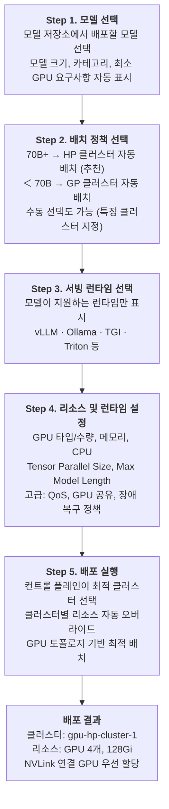
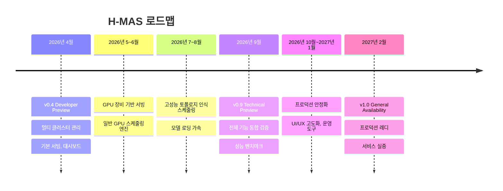

## 제품 개요

H-MAS는 온프레미스 환경에 분산된 GPU 서버들을 하나의 플랫폼에서 통합 관리하고, AI 모델을 최적의 하드웨어에 자동 배치하는 **AI 서빙 플랫폼**입니다.

여러 대의 GPU 서버를 하나의 컨트롤 플레인으로 묶고, 웹 콘솔에서 모델을 선택해 배포하면 GPU의 물리적 연결 구조를 고려하여 최적의 위치에 자동으로 스케줄링합니다. 장애 시에는 다른 클러스터로 자동 재배치하여 서빙 연속성을 보장합니다.

<p align="center">
  
  <br/>
  <em>H-MAS 대시보드 — 클러스터 상태, GPU 토폴로지, 인스턴스 현황을 한눈에 확인</em>
</p>

---

## 해결하는 문제

온프레미스에서 AI 모델을 서빙할 때 반복적으로 발생하는 문제들입니다.

| 문제 | 상세 |
|------|------|
| **GPU 활용률 저하** | GPU 서버가 여러 대 있지만 개별 운영되어 유휴 자원이 많고, 실제 활용률이 25% 수준에 머무는 경우가 흔함 |
| **스케줄링 한계** | 기본 Kubernetes 스케줄러는 GPU의 물리적 구조(PCIe, NUMA, 인터커넥트)를 인식하지 못해 하드웨어 성능을 온전히 활용하지 못함 |
| **관리 복잡성** | 서버마다 개별 SSH 접속, 모델 배포 시 수동 YAML 작성, 장애 대응도 수동 |
| **모델 배포 부담** | 모델마다 서빙 런타임 설정, GPU 할당, 네트워크 설정 등 반복 작업이 필요 |
| **장애 대응 공백** | 서버 장애 시 수동으로 다른 서버에 재배포해야 하며, 그 사이 서비스 중단 |

---

## 활용 시나리오

### 시나리오 1: GPU 서버 3~5대를 보유한 AI 스타트업

> "vLLM으로 자체 LLM을 서빙하고 있는데, 서버가 3대로 늘면서 관리가 힘들어졌습니다."

**현재 상황**
- 사무실에 RTX 4090 서버 2대, 클라우드에 L40S 서버 1대
- 서버마다 SSH로 접속해서 개별 관리
- 새 모델 배포할 때마다 YAML 파일 직접 작성
- 서버 1대가 다운되면 수동으로 다른 서버에 재배포

**H-MAS 도입 후**
- 3대의 서버를 하나의 플랫폼에 등록, 웹 대시보드에서 통합 관리
- 웹 콘솔에서 모델 선택 → 런타임 선택 → 배포 (YAML 작성 불필요)
- 서버 장애 시 자동으로 다른 서버에 재배치
- GPU 공유 기능으로 소형 모델 여러 개를 한 GPU에서 동시 서빙

### 시나리오 2: 이기종 GPU를 보유한 대학 연구실 / 연구소

> "A100 4장, RTX 3090 8장이 있는데 대형 모델은 A100에서, 소형 모델은 3090에서 돌리고 싶습니다."

**현재 상황**
- A100 서버(고성능)와 RTX 3090 서버(범용)가 혼재
- 어떤 모델을 어떤 서버에 배포할지 매번 수동 판단
- 대형 모델의 Tensor Parallelism 시 GPU 배치를 잘못하면 성능이 크게 저하
- 연구원마다 서버를 점유하여 자원 활용 비효율

**H-MAS 도입 후**
- A100 서버는 HP(High Performance) 클러스터, 3090 서버는 GP(General) 클러스터로 등록
- 70B+ 대형 모델은 자동으로 HP 클러스터에 배치, 토폴로지 인식 스케줄링으로 GPU 간 통신 최적화
- 소형 모델은 GP 클러스터에서 QoS 기반 우선순위 관리 (프로덕션 > 개발)
- 하나의 GPU를 여러 모델이 공유하여 활용률 90%+ 달성

### 시나리오 3: 자체 AI 서비스를 준비하는 중소기업 인프라팀

> "AI 모델 서빙을 시작하려는데, GPU 서버 관리부터 모델 배포까지 전담 인력이 부족합니다."

**현재 상황**
- GPU 서버를 구입했지만 AI 서빙 인프라 구축 경험이 부족
- Kubernetes는 운영 중이나 GPU 워크로드는 처음
- 서빙 런타임(vLLM, Triton 등) 선택과 설정에 시행착오가 많음
- 장애 대응 체계 미비

**H-MAS 도입 후**
- 기존 Kubernetes 클러스터에 H-MAS 설치, 웹 콘솔에서 즉시 사용
- 모델별 지원 런타임과 권장 GPU 설정을 자동 추천
- 배포 정책(자동/수동)을 선택하면 적합한 클러스터에 자동 배치
- 장애 복구 정책 설정으로 서비스 연속성 확보

---

## 기존 방식과의 비교

### 모델 배포

| 항목 | 기존 (kubectl + 수동) | H-MAS |
|------|---------------------|-------|
| 배포 방식 | YAML 직접 작성, kubectl apply | 웹 콘솔에서 모델/런타임/정책 선택 후 배포 |
| 클러스터 선택 | 관리자가 수동 판단 | 모델 크기 기반 자동 추천 + 수동 오버라이드 |
| GPU 할당 | 수동 지정, 토폴로지 고려 불가 | 토폴로지 인식 자동 배치 |
| 리소스 조정 | 클러스터마다 별도 YAML 수정 | 클러스터별 리소스 자동 오버라이드 |
| 소요 시간 | 30분~1시간 (숙련자 기준) | 5분 이내 |

### 운영 관리

| 항목 | 기존 | H-MAS |
|------|------|-------|
| 클러스터 현황 파악 | 서버별 SSH 접속, kubectl 명령 | 통합 대시보드 (GPU, 노드, 워크로드 한눈에) |
| 장애 대응 | 알림 확인 → 수동 재배포 (수십 분) | 자동 감지 → 자동 재배치 (5분 이내) |
| GPU 활용률 관리 | 모니터링 도구 별도 구축 필요 | 클러스터별 리소스 현황 통합 대시보드 *(v0.9: GPU 메트릭 차트)* |
| 로그 확인 | 서버별 접속, kubectl logs | 웹에서 배포별 Pod 로그 및 이벤트 조회 *(v0.9: 실시간 스트리밍)* |
| 다중 모델 관리 | 모델마다 개별 관리 | 인스턴스 목록에서 필터/검색, 일괄 관리 |

---

## 배포 워크플로우

H-MAS에서 AI 모델을 배포하는 과정입니다.

<table>
  <tr>
    <td></td>
    <td></td>
    <td></td>
  </tr>
  <tr>
    <td align="center"><b>모델 저장소</b></td>
    <td align="center"><b>런타임 및 배치 전략 선택</b></td>
    <td align="center"><b>배포된 인스턴스 상세</b></td>
  </tr>
</table>



---

## 핵심 기능

### 1. 멀티 클러스터 통합 관리

물리적으로 분산된 GPU 서버들을 하나의 컨트롤 플레인에 등록하고 통합 관리합니다.

- **Push 모드**: kubeconfig 업로드로 즉시 연결 (방화벽 내부 서버에 적합)
- **Pull 모드**: Bootstrap 토큰 기반 에이전트 연결 (외부 네트워크 서버에 적합)
- 클러스터별 GPU 가용량, 노드 상태, 워크로드 현황을 통합 대시보드에서 확인
- 사무실 워크스테이션, 서버실, 원격 서버 등 위치에 관계없이 등록 가능
- 설치된 스케줄러에 따라 클러스터 타입(HP/GP/Standard) 자동 결정

### 2. 웹 콘솔 기반 모델 배포

웹 UI에서 모델 선택부터 배포까지 전 과정을 수행합니다.

- 모델 선택 → 배치 정책 → 서빙 런타임 → 리소스 설정 → 배포
- vLLM, Ollama, Triton, TGI 등 9종 서빙 런타임 지원
- 모델 크기 기반 배치 정책 자동 추천 (70B+ → HP, 소형 → GP)
- 클러스터별 리소스 자동 오버라이드 (HP: GPU 4개/128Gi, GP: GPU 2개/64Gi)
- 복잡한 YAML 작성 불필요

### 3. 하드웨어 인지 스케줄링

GPU의 물리적 연결 구조를 인식하여 모델을 최적의 GPU에 배치합니다.

**이원화된 서빙 전략 (Dual-Track)**

H-MAS는 모델 크기에 따라 두 가지 트랙으로 서빙을 최적화합니다.

| | HP 트랙 (대형 모델) | GP 트랙 (중소형 모델) |
|---|---|---|
| **대상** | 70B+ LLM (Llama-3, Qwen-2.5 등) | OCR, 임베딩, 이미지 분류, 7~30B LLM |
| **핵심 문제** | 멀티 GPU 통신 병목 | GPU 활용률 저하, 자원 낭비 |
| **해결 방식** | GPU 토폴로지 인식 배치 — NVLink/PCIe 구조를 파악하여 통신 병목 최소화 | QoS 기반 우선순위 + GPU 공유 — 하나의 GPU에서 여러 모델 동시 실행 |
| **주요 기능** | 토폴로지 인식, NVLink 우선 할당, MIG 지원, Tensor Parallelism 최적화 | QoS 3단계 (프로덕션 > 스테이징 > 개발), GPU 공유, 오버커밋 |
| **대상 GPU** | A100, H100, DGX | L40S, T4, L4, A10, RTX 4090/5090 |

### 4. 자동 장애 복구

클러스터 장애 시 설정된 정책에 따라 워크로드를 다른 클러스터로 자동 재배치합니다.

- 장애 감지 후 설정된 시간(기본 5분) 이내에 자동 재배치
- 기존 Pod 유예 시간 설정으로 안전한 전환
- 수동 개입 없이 서빙 연속성 보장
- 장애 복구 정책을 배포 시점에 설정 (활성화/비활성화, 대기 시간 등)

### 5. 모델 저장소 (Model Registry)

배포할 AI 모델을 중앙에서 관리합니다.

- Built-in Registry: 모델 등록/수정/삭제, 서빙 설정(GPU 요구사항, 지원 런타임) 관리
- 모델 카테고리별 분류 (LLM, Vision, Code, Embedding)
- 배포 시 모델 크기 기반 배치 정책 및 런타임 자동 추천
- 외부 레지스트리 연동 (HuggingFace, MLflow 등) *(v0.9 제공)*

### 6. 모델 로딩 가속

모델 가중치를 캐싱하여 모델 로딩 시간을 단축합니다.

- **PVC 기반 로컬 캐시**: 모델 가중치를 클러스터 로컬 스토리지에 캐싱하여 재배포 시 다운로드 생략
- **분산 캐시 (v0.9)**: P2P Pre-fetch로 모델 가중치를 각 노드에 미리 다운로드
- **계층형 스토리지 (v0.9)**: Memory → SSD → HDD 순으로 캐시 계층 구성
- 오토스케일링 시 Cold Start를 30초 이내로 단축 목표

### 7. 통합 모니터링 및 로깅

배포된 모든 인스턴스의 상태를 모니터링합니다.

- 클러스터별 리소스 현황 실시간 업데이트
- 배포별 Pod 로그 조회 및 K8s 이벤트 확인
- 인스턴스 상태 이력 및 감사 로그 추적
- GPU 사용률, 메모리, RPS, 응답 지연시간 통합 차트 *(v0.9 제공)*
- 실시간 로그 스트리밍 *(v0.9 제공)*

---

## 아키텍처

Management Cluster에서 모든 배포를 중앙 관리하고, 모델 특성에 맞는 GPU 클러스터로 자동 분배합니다.

<p align="center">
  
  <br/>
  <em>H-MAS 전체 아키텍처 — 컨트롤 플레인이 HP/GP/Standard 클러스터를 통합 관리</em>
</p>

<!-- mermaid 원본 (이미지로 대체됨)
graph TD
    subgraph MC["Management Cluster"]
        UI["Web UI - 대시보드 · 모델 배포 · 모니터링 · 정책 관리"]
        API["API Server - 배포 관리 · 상태 조회 · 메트릭 · 로그"]
        CP["Control Plane - 클러스터 선택 · 리소스 오버라이드 · 장애 복구 · 배치 정책"]
        DB["PostgreSQL - 메타데이터 · 감사 로그"]
        UI ==> API ==> CP
        API -.-> DB
    end
    CP ==>|배치 정책 + 리소스 오버라이드| HP1
    CP ==>|배치 정책 + 리소스 오버라이드| HP2
    CP ==>|배치 정책 + 리소스 오버라이드| GP
    CP ==>|배치 정책 + 리소스 오버라이드| STD
    subgraph HP1["HP Cluster"] : 토폴로지 인식 스케줄링, A100/H100, Fluid Cache
    subgraph HP2["HP Cluster"] : 토폴로지 인식 스케줄링, H100, Fluid Cache
    subgraph GP["GP Cluster"] : QoS 기반 · GPU 공유, L40S/T4/L4, Fluid Cache
    subgraph STD["Standard Cluster"] : 기본 K8s 스케줄링, Any GPU
-->

### 3계층 가속 아키텍처

| 계층 | 역할 | 설명 |
|------|------|------|
| **Global Control** | 지능형 라우팅 | 모델 크기에 따라 HP/GP 클러스터로 트래픽 자동 분배 |
| **Compute Engine** | 하드웨어 인지 배치 | PCIe, NUMA 토폴로지 최적화로 데이터 전송 지연 최소화 |
| **Data Acceleration** | 모델 로딩 가속 | 분산 캐시로 모델 가중치를 사전 캐싱, 오토스케일링 30초 이내 |

### 클러스터 타입

| 타입 | 대상 GPU | 스케줄링 특성 | 적합 워크로드 |
|------|---------|-------------|-------------|
| **HP (High Performance)** | A100, H100, DGX | GPU 토폴로지 인식, NVLink/NVSwitch 최적화, MIG | 70B+ 대형 LLM, Tensor Parallelism |
| **GP (General)** | L40S, T4, L4, A10, RTX 4090/5090 | QoS 우선순위, GPU 공유, 오버커밋 | 중소형 모델, 다수 모델 동시 서빙 |
| **Standard** | 모든 GPU | 기본 Kubernetes 스케줄링 | 범용, GPU 최적화 불필요 시 |

---

## 성능 효과

### HP 클러스터 — 대형 모델 (70B+)

기본 Kubernetes 스케줄러 대비 성능 개선 수치입니다.

```
처리량 (Throughput)     ████████████████░░░░  1.5x ~ 1.7x 향상
응답 지연시간 (Latency)  ████████████░░░░░░░░  29% ~ 42% 감소
GPU 간 통신 효율         ████████████████████  14x ~ 28x 향상
```

GPU 간 인터커넥트 대역폭:

| 인터커넥트 | 대역폭 | 클러스터 |
|-----------|--------|---------|
| NVLink 4.0 | 900 GB/s | HP |
| NVLink 3.0 | 600 GB/s | HP |
| PCIe 5.0 | 64 GB/s | HP/GP |
| PCIe 4.0 | 32 GB/s | GP |

토폴로지 인식 스케줄링은 NVLink 연결된 GPU를 우선 할당하여, PCIe 대비 **14~28배 높은 대역폭**으로 GPU 간 통신을 수행합니다. 이는 Tensor Parallelism 시 GPU 간 데이터 교환이 빈번한 대형 모델에서 직접적인 성능 향상으로 이어집니다.

### GP 클러스터 — 중소형 모델

```
처리량 (Throughput)     ████████████░░░░░░░░  1.26x ~ 1.55x 향상
GPU 활용률              ████████████████████  25% → 90%+
비용 효율               ████████████████░░░░  2x ~ 3x 개선
```

QoS 기반 스케줄링과 GPU 공유를 통해, 기존에 모델 하나가 점유하던 GPU에서 여러 모델을 동시 실행합니다. 우선순위 관리(프로덕션 > 스테이징 > 개발)로 서비스 품질을 보장하면서도 유휴 자원을 최대한 활용합니다.

---

## 지원 서빙 런타임

| 런타임 | 특징 | 주요 용도 |
|-------|------|----------|
| **vLLM** | PagedAttention, Continuous Batching | 고성능 LLM 서빙 (추천) |
| **Ollama** | 간편한 설정, 빠른 시작 | 로컬 LLM 실행, 프로토타이핑 |
| **Triton** | 멀티 프레임워크, 앙상블 모델 | 복합 추론 파이프라인 |
| **TGI** | HuggingFace 생태계 통합 | HuggingFace 모델 프로덕션 서빙 |
| **SGLang** | RadixAttention, 구조화된 생성 | 구조화된 출력 최적화 |
| **TensorRT-LLM** | NVIDIA GPU 극한 최적화 | 최고 성능이 필요한 경우 |
| **LMDeploy** | TurboMind 엔진, 다양한 모델 | 범용 고성능 서빙 |
| **llama.cpp** | CPU/GPU 효율적 추론, GGUF | 경량 환경, CPU 추론 |
| **TEI** | HuggingFace Text Embeddings 최적화 | 임베딩 모델 서빙 |

모델별 지원 런타임을 배포 시 자동으로 필터링하여 표시합니다.

---

## 화면 구성

### 대시보드

<p align="center">
  
  <br/>
  <em>통계 카드, 인스턴스 상태 차트, GPU 토폴로지, 최근 활동을 한 화면에서 확인</em>
</p>

전체 인프라 현황을 한눈에 파악합니다.

- **통계 카드**: 전체 클러스터 수, 인스턴스 수, GPU 총량/사용량, 초당 요청 수
- **인스턴스 상태 차트**: Running / Stopped / Error / Pending 분포
- **런타임별 분포**: 어떤 서빙 런타임이 가장 많이 사용되는지
- **클러스터 현황**: 클러스터별 상태, 스케줄러 타입, GPU 가용량
- **최근 활동**: 배포, 장애 복구, 스케일 변경 등 이벤트 로그

### 클러스터 관리

<p align="center">
  
  <br/>
  <em>클러스터를 GPU 타입별로 분류하고, 각 클러스터의 GPU 사용량과 스케줄러 정보를 확인</em>
</p>

- HP/GP/Standard 클러스터를 타입별로 구분하여 표시
- 클러스터별 GPU 현황, 노드 수, 인스턴스 수
- GPU/NUMA 토폴로지 시각화 (노드별 GPU 배치, 인터커넥트 표시) *(v0.4: UI 완성, v0.9: 실데이터 연동)*
- Push/Pull 모드로 클러스터 등록/해제

<p align="center">
  
  <br/>
  <em>노드별 NUMA 구조와 GPU 배치, NVLink/PCIe 인터커넥트 연결을 시각화</em>
</p>

### 모델 배포

<p align="center">
  
  <br/>
  <em>모델 선택, 서빙 런타임, 배치 전략을 한 화면에서 설정하는 배포 폼</em>
</p>

- 5단계 가이드 배포 폼 (모델 → 정책 → 런타임 → 리소스 → 배포)
- 모델 크기 기반 정책 자동 추천 + 불일치 경고
- 고급 설정: 토폴로지, QoS, GPU 공유, 장애 복구 등
- 배포 결과: 선택된 클러스터, 적용된 리소스, 스케줄링 상세 표시

### 인스턴스 관리

<p align="center">
  
  <br/>
  <em>인스턴스 목록 — 상태, 런타임, 클러스터별 필터링과 검색</em>
</p>

- 필터링 (상태, 런타임, 클러스터별) 및 검색
- 상세 정보: 모델, 클러스터, 정책, 리소스 설정, 장애 복구 상태
- 인스턴스별 시작/중지/스케일/삭제 *(v0.9 제공)*

<p align="center">
  
  <br/>
  <em>인스턴스 상세 — 외부 엔드포인트, 리소스 현황, 런타임 설정을 한눈에 확인</em>
</p>

### 모니터링 및 로그

<p align="center">
  
  <br/>
  <em>GPU 사용량, 메모리, RPS, 지연시간 차트와 실시간 로그 스트리밍</em>
</p>

- 배포별 Pod 로그 조회 및 K8s 이벤트 확인
- 감사 로그 (플랫폼 활동 이력)
- GPU 사용률, 메모리, RPS, 지연시간 실시간 차트 *(v0.9 제공)*
- 실시간 로그 스트리밍 및 레벨 필터 *(v0.9 제공)*

---

## 시스템 요구사항

### Management Cluster (컨트롤 플레인)

| 항목 | 최소 사양 | 권장 사양 |
|------|---------|---------|
| Kubernetes | 1.26+ | 1.29+ |
| 노드 | 1대 | 3대 (HA 구성) |
| CPU | 4 코어 | 8 코어 |
| 메모리 | 8 GB | 16 GB |
| 디스크 | 50 GB SSD | 100 GB SSD |

Management Cluster에는 GPU가 필요하지 않습니다. 기존에 운영 중인 Kubernetes 클러스터를 사용할 수 있습니다.

### Member Cluster (워크로드 실행)

| 항목 | 요구사항 |
|------|---------|
| Kubernetes | 1.26+ |
| GPU | NVIDIA GPU 1장 이상 |
| GPU Driver | NVIDIA Driver 525+ |
| Container Runtime | containerd 1.6+ |
| 네트워크 | Management Cluster와 통신 가능 |

### 지원 GPU

| 카테고리 | GPU 모델 |
|---------|---------|
| 데이터센터 | A100, H100, H200, L40S, L4, T4, A10 |
| 워크스테이션 | RTX 4090, RTX 5090, RTX A6000 |
| DGX | DGX A100, DGX H100, DGX Spark |

CUDA 지원 NVIDIA GPU라면 Standard 클러스터로 등록하여 기본 스케줄링이 가능합니다.

---

## 로드맵

| 시점 | 버전 | 내용 |
|------|------|------|
| **2026년 4월** | **v0.4 (DP)** | Developer Preview — 멀티 클러스터 관리, 기본 서빙, 대시보드 |
| 5~6월 | — | GPU 장비 기반 서빙, 일반 GPU 스케줄링 엔진 |
| 7~8월 | — | 고성능 GPU 토폴로지 인식 스케줄링, 모델 로딩 가속 |
| **2026년 9월** | **v0.9 (TP)** | Technical Preview — 전체 기능 통합 검증, 성능 벤치마크 |
| 10월~1월 | — | 프로덕션 안정화, UI/UX 고도화, 운영 도구 |
| **2027년 2월** | **v1.0 (GA)** | General Availability — 프로덕션 레디, 서비스 실증 |



### 버전별 제공 기능

| 기능 | v0.4 (DP) | v0.9 (TP) | v1.0 (GA) |
|------|:---------:|:---------:|:---------:|
| 멀티 클러스터 관리 (Push/Pull) | v | v | v |
| 웹 콘솔 기반 모델 배포 | v | v | v |
| 통합 대시보드 | v | v | v |
| 자동 장애 복구 | v | v | v |
| 로그 조회/이벤트/감사 로그 | v | v | v |
| 실시간 메트릭 모니터링 (GPU, RPS) | — | v | v |
| GP 스케줄링 (QoS, GPU 공유) | — | v | v |
| HP 스케줄링 (토폴로지 인식) | — | v | v |
| 모델 로딩 가속 (분산 캐시) | — | v | v |
| 모델 저장소 (Built-in Registry) | v | v | v |
| 모델 레지스트리 (외부 연동) | — | v | v |
| 기본 인증 (JWT) | v | v | v |
| 인증 고도화 (RBAC, OAuth/OIDC) | — | v | v |
| 프로덕션 안정화 | — | — | v |
| 운영 도구 (알림, 헬스체크 자동화) | — | — | v |

---

## 자주 묻는 질문 (FAQ)

**Q. 기존에 운영 중인 Kubernetes 클러스터에 설치할 수 있나요?**
네. H-MAS는 기존 Kubernetes 클러스터 위에 설치됩니다. 별도의 전용 클러스터가 필요하지 않습니다. Management Cluster 하나를 설정하고, 기존 GPU 서버 클러스터를 Member로 등록하면 됩니다.

**Q. GPU가 1장뿐인 서버도 등록할 수 있나요?**
네. GPU 1장 서버도 Standard 또는 GP 클러스터로 등록하여 사용할 수 있습니다. 소형 모델 서빙에 활용하거나, 다른 클러스터의 장애 복구 대상으로 설정할 수 있습니다.

**Q. NVIDIA GPU가 아닌 AMD GPU도 지원하나요?**
현재는 NVIDIA GPU만 지원합니다. GPU 토폴로지 인식 스케줄링과 MIG 등 NVIDIA 고유 기능에 최적화되어 있습니다.

**Q. 클라우드 GPU 인스턴스도 연결할 수 있나요?**
네. Kubernetes가 설치된 환경이라면 온프레미스/클라우드 상관없이 Member 클러스터로 등록할 수 있습니다. Pull 모드를 사용하면 방화벽 뒤의 클러스터도 연결 가능합니다.

**Q. 설치에 얼마나 걸리나요?**
Management Cluster 설치와 첫 번째 Member 클러스터 등록까지 약 30분~1시간 정도 소요됩니다. 이후 추가 클러스터 등록은 5~10분이면 완료됩니다.

**Q. 학습(Training)도 지원하나요?**
아니요. H-MAS는 AI 모델 서빙(Inference)에 집중합니다. 학습된 모델을 서빙하는 데 최적화된 플랫폼입니다.

**Q. Developer Preview(v0.4)에서 사용 가능한 기능이 제한적이지 않나요?**
v0.4에서는 기본 Kubernetes 스케줄러 환경에서 동작하므로 GPU 토폴로지 인식 스케줄링은 제공되지 않습니다. 하지만 멀티 클러스터 관리, 웹 콘솔 배포, 대시보드, 자동 장애 복구 등 핵심 관리 기능은 모두 사용할 수 있으며, 파일럿 파트너에게는 이후 매월 새 기능이 업데이트됩니다.

**Q. 기존 vLLM/Ollama 등으로 이미 서빙 중인 모델이 있는데, H-MAS로 옮길 수 있나요?**
네. H-MAS는 vLLM, Ollama 등 기존 서빙 런타임을 그대로 사용합니다. 기존 모델 설정을 H-MAS 배포 폼에 입력하면 동일한 환경으로 배포됩니다.

**Q. 클러스터가 1개뿐인데도 사용할 수 있나요?**
네. Management Cluster와 워크로드 실행 클러스터를 같은 클러스터에서 운영할 수 있습니다. 단일 클러스터에서도 웹 콘솔 배포, 대시보드, 로그 등 모든 관리 기능을 동일하게 사용하며, 나중에 클러스터를 추가하면 동일한 운영 방식으로 확장됩니다.

**Q. 보안/인증은 지원하나요?**
v0.4에서는 JWT 기반 로그인 인증을 제공하여 API 접근을 보호합니다. v0.9에서는 RBAC(역할 기반 접근 제어), 사용자 관리 UI, OAuth/OIDC 외부 인증 연동이 추가될 예정입니다.

---

## 요약

| 항목 | 내용 |
|------|------|
| **제품명** | H-MAS (Hardware-aware Multi-Cluster AI Serving Platform) |
| **분류** | 온프레미스 AI 서빙 플랫폼 |
| **핵심 가치** | GPU 활용률 극대화, 멀티 클러스터 통합 관리, 하드웨어 인지 최적 배치 |
| **대상** | GPU 인프라를 보유한 스타트업, 연구소, 대학 연구실, 중소기업 |
| **현재 버전** | Developer Preview (v0.4.0) — 2026년 4월 출시 |
| **연락처** | [parameterfreak@gmail.com](mailto:parameterfreak@gmail.com) |
